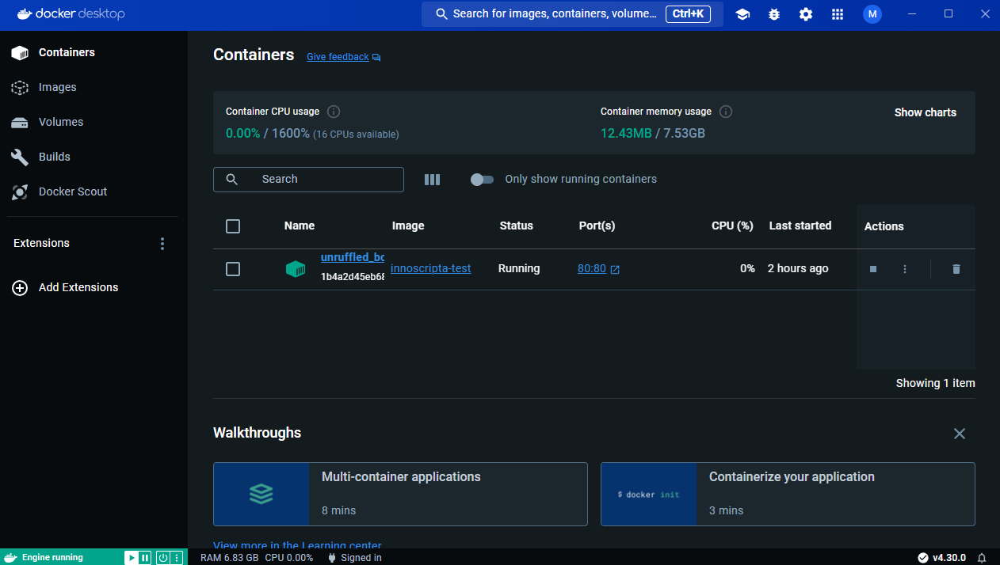
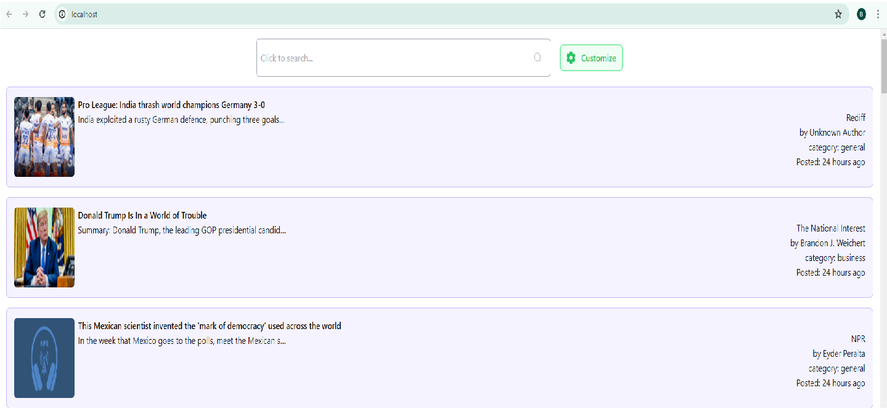

# Innoscripta Project

## Running the Project in a Docker Container

This guide will help you run the Innoscripta project using Docker. Follow the steps below to ensure a smooth setup.

### Prerequisites
1. **Docker**: Ensure Docker is installed, configured, and running on your operating system. This guide assumes you are using Docker Desktop.

### Steps to Run the Docker Container

1. **Navigate to the Project Root Directory**
    ```sh
    cd /path/to/project/root
    ```

2. **Build the Docker Image**
    ```sh
    docker build -t innoscripta-test .
    ```
    Ensure that you include the dot ('.') at the end of the command as it signifies the current directory.

3. **Run the Docker Container**
    ```sh
    docker run -p 80:80 innoscripta-test
    ```
    This command will map port 80 of your local machine to port 80 of the Docker container.

### Verifying the Container

After running the above commands, you should see the following screen in Docker Desktop:


Clicking on '80:80' under the "Port(s)" section will redirect you to the running application, which should look like this:


By following these steps, you will have the Innoscripta project up and running within a Docker container. If you encounter any issues, ensure Docker is properly installed and running, and that you are executing the commands from the project's root directory.

## Running the Project with npm

To run this project with npm, follow these steps:

1. **Install Dependencies**
    ```sh
    npm i
    ```

2. **Create Accounts and Generate API Keys** from:
   - [newsapi.org](https://newsapi.org)
   - [developer.nytimes.com/apis](https://developer.nytimes.com/apis)
   - [newsapi.ai](https://newsapi.ai/)

3. **Create `.env.local` file** with the following variables:
    ```env
    REACT_APP_NYTIMES_API_KEY=<key for newsapi.org>
    REACT_APP_AI_NEWS_API_KEY=<key for newsapi.ai>
    REACT_APP_NEWS_API_ORG_KEY=<key for New York Times api>
    ```

4. **Run npm command to start the project:**
    ```sh
    npm run start
    ```

By following these steps, you will have the Innoscripta project running locally with npm. Make sure you have the necessary API keys and the environment variables set correctly.

## Note 1
If you want to see the Vercel deployed version, you can visit this link [Innoscripta on Vercel](https://innoscripta-three.vercel.app/), but 'newsapi.org' doesn't work on the production environment, so there will be no search results as I used newsapi.org for search results.

## Note 2
the different colors of articles on home page represent the different results from different APIs